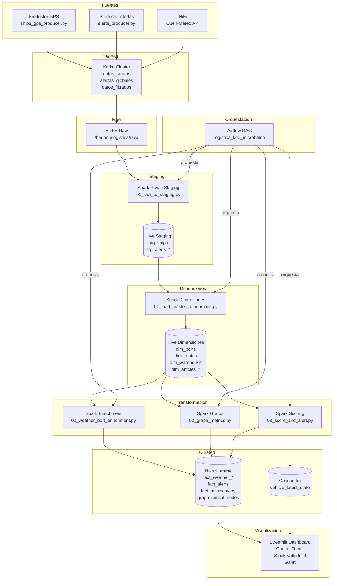

# Diagrama de Arquitectura



---

## Flujo de Datos

```
1. Productores → Kafka (datos_crudos, alertas_globales)
2. Consumidor → HDFS Raw (/raw/ships, /raw/clima, /raw/noticias)
3. Spark Raw→Staging → Hive Staging (stg_*)
4. Spark Dimensiones → Hive Dimensiones (dim_*)
5. Spark Enrichment → Hive Curated (fact_*)
6. Spark Grafos → Hive Curated (graph_*)
7. Spark Scoring → Hive Curated + Cassandra
8. Dashboard → Lee Hive + Cassandra
```

---

## Componentes por Capa

| Capa | Componente | Función |
|------|-----------|---------|
| Ingesta | Kafka | Message broker, pub/sub |
| Ingesta | NiFi | API integration (Open-Meteo) |
| Raw | HDFS | Persistencia auditoría |
| Staging | Spark + Hive | Limpieza, tipado, deduplicación |
| Dimensiones | Spark + Hive | Catálogos maestros |
| Transformación | Spark | Enrichment, grafos, ML |
| Curated | Hive + Cassandra | Facts analíticos, estado último |
| Orquestación | Airflow | DAG, reintentos, alertas |
| Visualización | Streamlit | Dashboard operacional |
